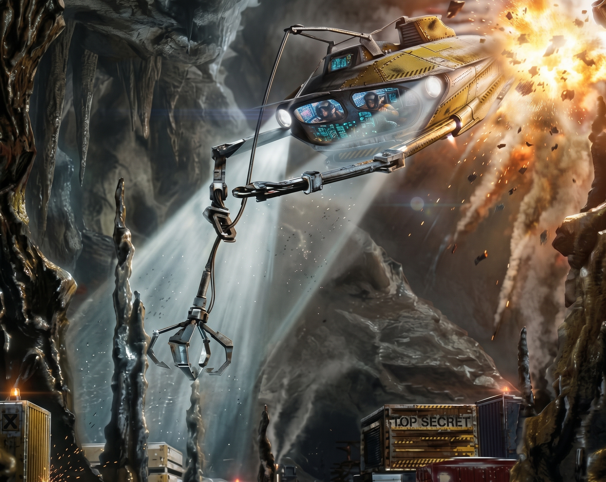

# Gravity Farce

#### **There are many gravity games, many copy-cats and some predecessors.**  
### But `Gravity Force` was simply the best.  

It was in the backlog for 30-35 years but I now finally got around to finding out **why** it was awesome.  
So I decided to throw some hours at reverse engineering it and ... we have a (in spirit) port that will run in the browser.

### Server and Cheating
I deviated pretty strongly on a few parts. One was: I did not really fancy the split-screen. I went for 
networked instead. The server is authorative, so it should be hard(er) to cheat (why-people-why, let everyone enjoy it!).
But, eh, anti-cheating is a billion-dollar industry so, yeah... 

### Records
Second big deviation, records and scores.
The best part about Gravity Force to me was multi-player. I think almost everyone will agree (except Fred).
Bummer was you needed your mate in the same room for that sweet split-screen. There were ups and downs to this,
it was nice to give someone a punch on the arm when they were being an ass (read: won). And ... luckily I am a good winner. Anyway, I digress.  

This version of GF keeps track of all kinds of high-scores and records for both single and multiplayer globally. You don't have to snail-mail your mate your fastest time on the "8 race". You just race on the same server.  

_But obviously, multi-player is the way to go! `:D`_

### Try it
... todo ...

### Levels and Data
All levels (multi- and single player) and power-ups and similar structures are ported over from the
original game. For instance, all enemies and turrets should move pretty much exactly the same as 
in the original game. There is documentation on some of the funky stuff in the `doc` dir.

### Not really a port
It's not really a port. I have tried to get the _feeling_ correct. It is written from scratch. Essentially I started with a simple skeleton of what I think would be in there and then I started digging in the assembly code. So yes, absolutely, there are subtle and not so subtle differences _everywhere_. 

### Party like it's 1989
Hopefully you can enjoy some 1989 magic in a new suit. I had fun creating it. And yeah, "creating things" was always the fun part, the tools used were always rather secondary.

### The funkies
I (and my best friend, the LLM) have tried to document as much of the weirder details as I could in `doc`, but some were lost along the way.

### Run your own server
... todo ...
